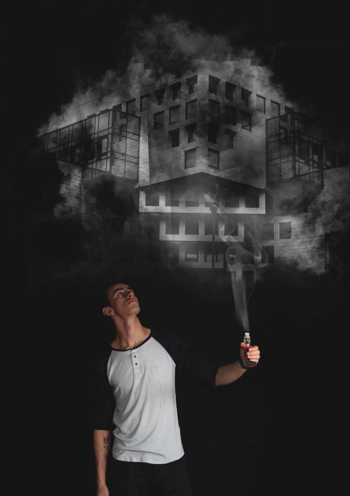

>Project : Photomontage 
>Title : Design of a photo editing and mastery of photography in studio 
>Author : Donaël Walter  
>Tools : Canon EOS, Photoshop CC 
----------------------------------------------------------
## NOTE OF INTENTION :

### Editing Photography.

When designing the studio photos, my first idea was to mix the past, the present
and the future. That’s why my first portrait photo referred to the past, my
present and my picture of the environment in the future. Unfortunately by wanting to gather these three photos designed independently, I realized that she was not going together and that
photomontage exercise will be difficult. That’s when I decided to redo the photo of
portrait and therefore to evolve my idea.

In my current photomontage, I wanted to wear a fantastic side to the photo by doing
appear a world through the smoke generated by the electronic cigarette. The object here becomes a
magic object capable of opening parallel worlds. It can evoke to us the lamp of Aladdin has
can make things appear. Here the model can only observe this world through this
smoke because, the smoke remains something fragile. Any attempt to seize this world would only
to make it disappear. The character is therefore a prisoner of are world and only for the power of
Look at the world through the smoke.

**PHOTO FINAL ASSEMBLY:**

